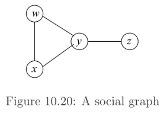
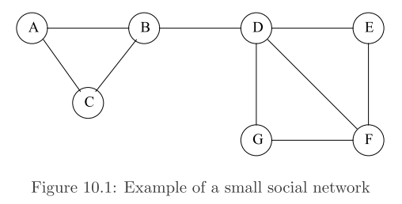
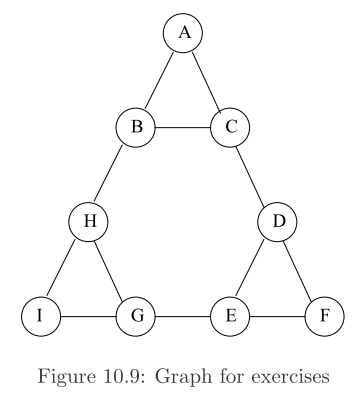
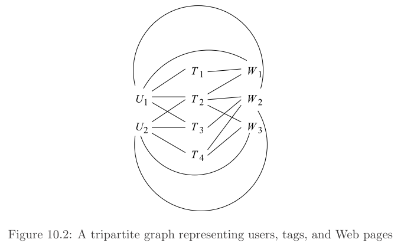

```{r global_options, include=FALSE}
# This is a way to set options for all code chunks at once
# Note that you can also dynamically control options by setting them to a value
# DPI setting increased for Word output, cairo is anti aliasing
knitr::opts_chunk$set(warning=FALSE, message=FALSE)
```

   


## 10.5.1 (Section 10.5.5)
Suppose graphs are generted by picking a probabliity *p* and choosing each edge independently with probability *p*, as in Example 10.21. For the graph of Fig. 10.20, what value of *p* gives the maximum likelihood of seeing that graph? What is the probability this graph is generated?

There are $\binom{4}{2} =$ `r choose(4, 2)` pairs of nodes. The probability this graph is generated is:

$$p^4(1-p)^2$$

To find the value of *p* that maximizes this:

$$\begin{array}{rcl}
  \frac{d}{dp} p^4(1-p)^2 & = & 0\\
  p^4(2(1-p)(-1)) + (1-p)^2(4p^3) & = & 0\\
  2p^5 - 2p^4 + (1 -2p +p^2)(4p^3) & = & 0\\
  2p^5 - 2p^4 + 4p^3 - 8p^4 + 4p^5 & = & 0\\
  2(3p^5 - 5p^4 + 2p^3) & = & 0\\
  p^3(3p^2 - 5p + 2) & = & 0\\
  p^3(3p - 2)(p - 1) & = & 0\\
\end{array}$$
 
The potential maximum values are 0, 2/3, and 1. 0 and 1 will make the probability 0, so the value of *p* that maximizes the probability is 2/3.

The probability this graph is generated is $(2/3)^4(1 - 2/3)^2 =$ `r (2/3)^4 * (1/3)^2`


## 10.7.1 (Section 10.7.6)
How many triangles are there in the graphs:

```{r}
library(dplyr)

find_triangles <- function(edges) {
  names(edges) <- c("A", "B")
  # for edges = E and |><| = 'natural join' do:
  # [ E(X, Y) |><| E(Y, Z) ] |><| E(X, Z)
  return(
    
    inner_join(
      # E(X, Y) |><| E(Y, Z)
      inner_join(edges, edges, by=c("B" = "A")),
      # . |><| E(X, Z)
      edges, by="A"
    ) %>%
      setNames(., c("X", "Y", "Z1", "Z2")) %>%
      # if Z1 == Z2 there exists X -> Y -> Z and X -> Z
      # this is a triangle
      filter(Z1 == Z2) %>%
      # clean up
      select(X, Y, Z1) %>%
      setNames(., c("i", "j", "k"))
    
  )
}
```

\pagebreak

### 10.7.1 (a)
Figure 10.1.



```{r}
# Sparse matrix representation
E = as.data.frame(matrix(c("A", "B",
                           "A", "C",
                           "B", "C",
                           "B", "D",
                           "D", "E",
                           "D", "F",
                           "D", "G",
                           "E", "F",
                           "F", "G"),
                         ncol = 2,
                         byrow = TRUE))
colnames(E) <- c("A", "B")

knitr::kable(find_triangles(E))
```

\pagebreak

### 10.7.1 (b)
Figure 10.9



```{r}
# Sparse matrix representation
E = as.data.frame(
  matrix(c("A", "B",
           "A", "C",
           "B", "C",
           "B", "H",
           "C", "D",
           "D", "E",
           "D", "F",
           "E", "F",
           "E", "G",
           "G", "H",
           "G", "I",
           "H", "I"
            ),
         ncol = 2, 
         byrow = TRUE)
  )
colnames(E) <- c("A", "B")

knitr::kable(find_triangles(E))
```

\pagebreak

### 10.7.1 (c)
Figure 10.2



```{r}
# Sparse matrix representation
E = as.data.frame(
  matrix(c("T1", "U1",
           "T1", "W1",
           "T2", "U1",
           "T2", "U2",
           "T2", "W1",
           "T2", "W2",
           "T2", "W3",
           "T3", "U1",
           "T3", "U2",
           "T3", "W2",
           "T4", "U2",
           "T4", "W2",
           "T4", "W3",
           "U1", "W1",
           "U1", "W2",
           "U2", "W2",
           "U2", "W3"
           ), 
         ncol = 2, 
         byrow = TRUE)
  )
colnames(E) <- c("A", "B")
```

\pagebreak

```{r}
knitr::kable(find_triangles(E))
```

\pagebreak

## Discussion Problem

Let's see if we can get a measure of performance

```{r}
library(microbenchmark)
library(ggplot2)

tm <- microbenchmark(find_triangles(E))
autoplot(tm)
print(tm)
```


